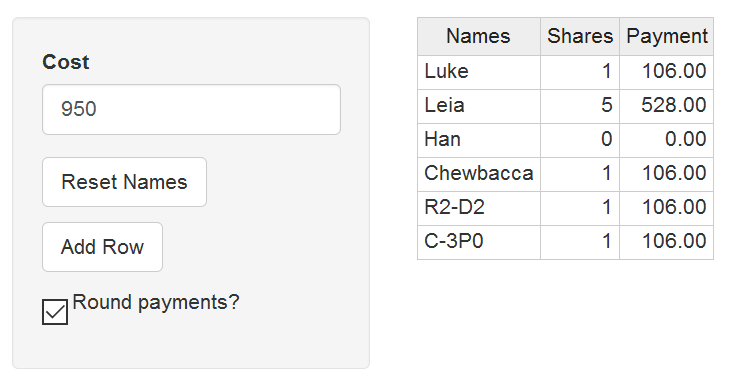

## A fairer way of splitting costs

Going on holiday in a large group is great fun, but splitting costs is difficult.


One approach is to allocate a number of shares per person or family
* 3 shares for a family
* 2 shares for a couple
* 1 share for an individual

Our web app makes it easy to do calculate the shares, even on a mobile device.

https://chrislill.shinyapps.io/cost-sharing

--- &twocol

## Easy to use

For example, let's pretend that our favourite Star Wars characters are picking up a bill for celebrations after destroying the first Death Star. Leia picks up a greater share because she's a Princess, where as Han is saving to pay off Jabba.

*** =left

1. Enter the cost
2. Click Reset Names
3. Click Add Row four times
4. Enter the names
5. Allocate shares for each person
6. Select Round Payments. Only Threepio likes messing around with fractions of a galactic credit.

*** =right



---

## Possible additional features

1. Add a check of the total and number of shares
2. Handle rounding errors
3. Add a graph showing who pays what (see next page)

```{r graphcode, eval = FALSE}
    
# Reorder the names so that the plot is in the correct order
cost.table$name2 <- reorder(cost.table$name, nrow(cost.table):1)
    
ggplot(cost.table, aes(x = name2, y = payment)) +
  geom_bar(stat = "identity", fill = "limegreen") +
  coord_flip() +
  geom_text(aes(label = payment, hjust = 1.3)) +         
  theme(legend.position = "none", panel.grid = element_blank(),
        axis.text.x = element_blank(), axis.ticks.x = element_blank(),
        axis.ticks.y = element_blank()) +
  labs(x = NULL, y = NULL) 
```

--- &twocol

## Payments graphic

```{r data, echo = FALSE}
library(ggplot2)    
cost.table <- data.frame(name = c('Ashby', 'Bradley', 'Grogan', 'Judge', 'Laud',
                                  'Lill', 'Megan', 'Pollard', 'Quinlan'),
                         shares = as.integer(c(3, 3, 2, 3, 3, 3, 3, 3, 1)),
                         payment = 0,
                         stringsAsFactors = FALSE)
share.cost <- 950 / 24
cost.table$payment <- round(share.cost * cost.table$shares, 2)
    
```

*** =left

```{r graphoutput, echo = FALSE}
    
# Reorder the names so that the plot is in the correct order
cost.table$name2 <- reorder(cost.table$name, nrow(cost.table):1)
    
ggplot(cost.table, aes(x = name2, y = payment)) +
  geom_bar(stat = "identity", fill = "limegreen") +
  coord_flip() +
  geom_text(aes(label = payment, hjust = 1.3)) +         
  theme(legend.position = "none", panel.grid = element_blank(),
        axis.text.x = element_blank(), axis.ticks.x = element_blank(),
        axis.ticks.y = element_blank()) +
  labs(x = NULL, y = NULL) 
```

*** =right

This graph was partially implemented in the Shiny App, but is commented out because further work is needed to hook it up correctly to all the reactive events.
